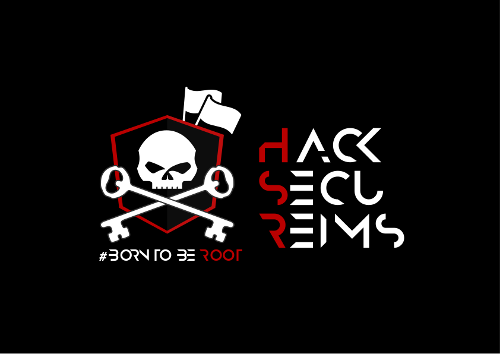
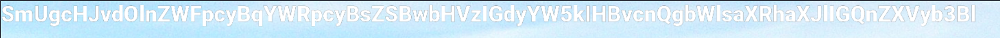
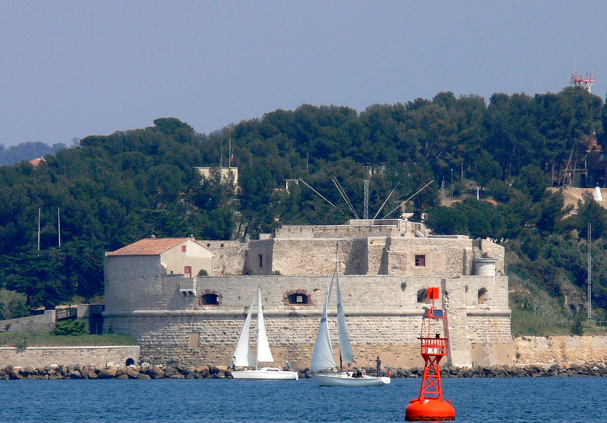
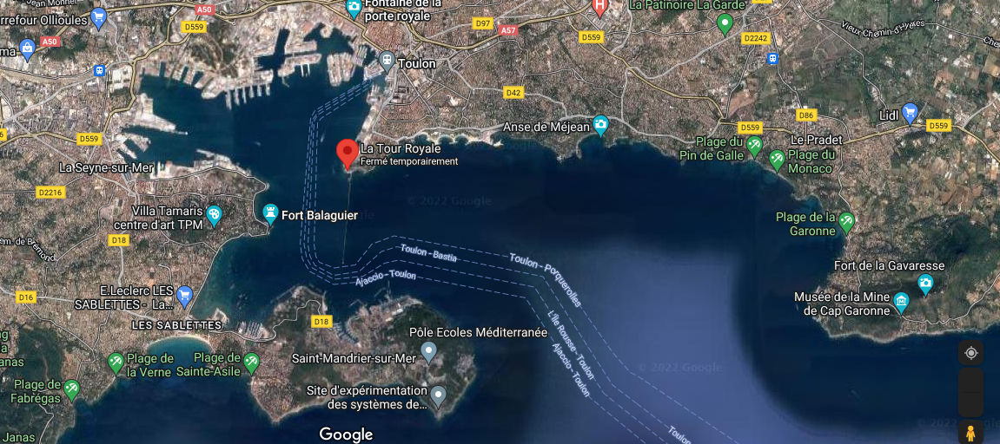
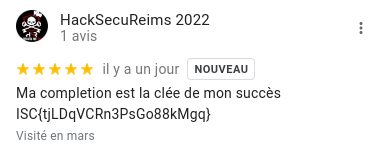
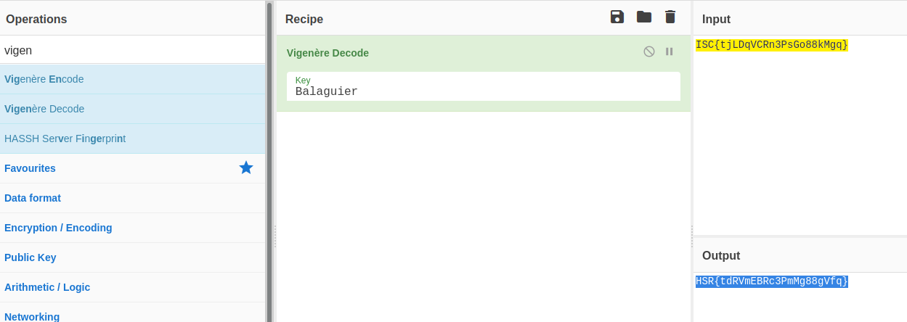

# Stegano ? Not really...

## Enoncé

> Vous prendrez bien un peu de soleil ?


## Fichiers

Le challenge mettait à disposition le fichier suivant :


## Writeup


### Analyse de l'image

L'énoncé annonce clairement la couleur du challenge, contrairement au challenge "A bit Hidden" nous n'avons pas à faire à un challege de steganographie.

Nous nous concentrons sur l'image, et nous pouvons voir assez rapidement que de du texte est caché dans l'angle supérieur gauche de l'image : 




### Analyse du texte

Nous avons ici à faire à une chaine de carractères encodée en base64, effectuons le décodage de cette chaine : 

```bash
┌─[ravenxploit@RX]─[~/HSR_2022/MCT/MISC/Stegano_Not_really]
└──╼ $echo "SmUgcHJvdOlnZWFpcyBqYWRpcyBsZSBwbHVzIGdyYW5kIHBvcnQgbWlsaXRhaXJlIGQnZXVyb3Bl" | base64 -d
Je protégeais jadis le plus grand port militaire d'europe
```

### Analyse de l'énigme

Quelques recherches nous apprennent que le port de Toulon, le plus grand port millitaire d'Europe, est protégé par un ensemble de forts construits au fil du temps :

> "C'est le premier ouvrage d'une longue série de forts destinés à protéger ce lieu stratégique qu'est la rade de Toulon, où est concentrée aujourd'hui une bonne partie de la flotte de guerre française"
> 
> Source : https://fr.wikipedia.org/wiki/Tour_royale


Cet ouvrage est la tour Royale, autrement appellée la grosse tour : 



Le challenge ayant été tagué comme un challenge de GEOINT, nous nous tournons vers google map : 




L'analyse des commentaires nous permet de découvrir l'information suivante : 



> Ma complétion est la clée de mon succès
> 
> ISC{tjLDqVCRn3PsGo88kMgq}


Nous pouvons observer que le texte semble chiffré via une technique par substitution. L'indice trouvé dans les commentaires faisant état d'une clée, nous pouvons penser à un chiffrement via la technique appellée "chiffre de vigenère". 

### Déchiffrement

L'indice trouvé parle de "complétion". Il est possible, en s'intéréssant à l'histoire de la défense du port de Toulon, de découvir que la tour Royale ne pouvait pas couvrir l'intégralité de l'entrée du port de Toulon avec ces cannons : 

"La portée de ses canons lui interdisant de verrouiller totalement l'accès de la rade, elle fut complétée, un siècle et demi plus tard, par le fort Balaguier et le fort de l'Éguillette, situés en vis-à-vis, sur le territoire de La Seyne-sur-Mer."

Afin de déchiffrer le flag nous utilisons un outil très utile pour les CTFs nommé "[CyberChef](https://gchq.github.io/CyberChef/)".

Cet outil est mis librement à disposition par le "Government Communications Headquarters (GCHQ)", le service gouvernemental du Royaume-Uni responsable du renseignement d'origine électromagnétique et de la sécurité des systèmes d'information. L'équivalent Anglais de notre "Direction générale de la Sécurité extérieure" nationale.

L'utilisation du block "Vigenère Décode" et de la clé "Balaguier" nous permet de découvrir le flag: 




## Flag 

HSR{tdRVmEBRc3PmMg88gVfq}
